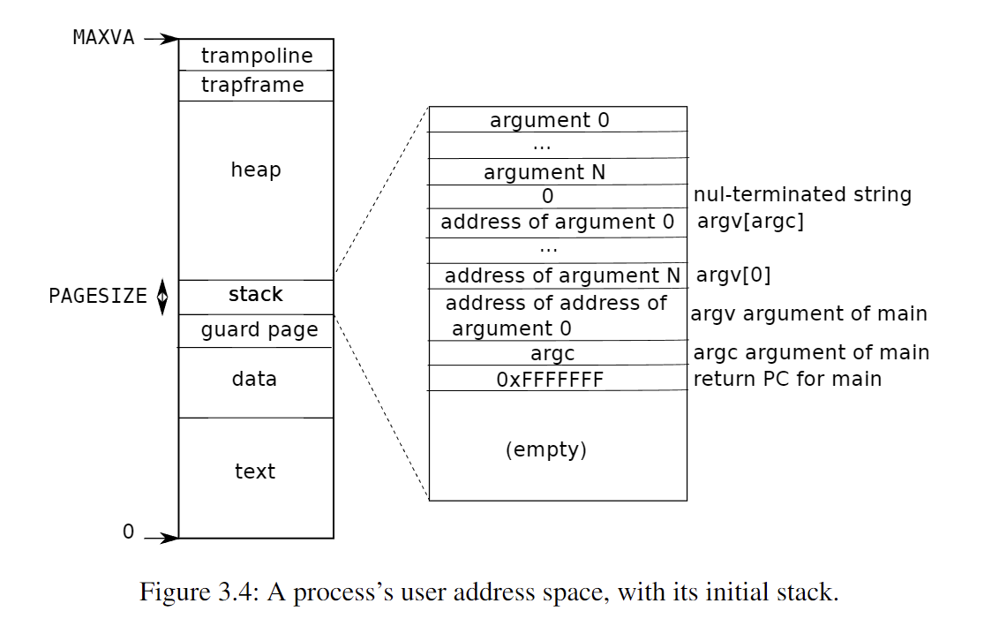

# xv6 Lab 3: Inspect a User-Process Page Table (easy)

## Overview

In this task, we run the `pgtbltest` user program and inspect the page table of a user process in xv6.  
We use the `print_pgtbl` function to display the page table entries (PTEs), then analyze and explain each mapping.

---

## Output
```
xv6 kernel is booting

hart 2 starting
hart 1 starting
init: starting sh
$ pgtbltest
print_pgtbl starting
va 0x0 pte 0x21FC885B pa 0x87F22000 perm 0x5B
va 0x1000 pte 0x21FC7C17 pa 0x87F1F000 perm 0x17
va 0x2000 pte 0x21FC7807 pa 0x87F1E000 perm 0x7
va 0x3000 pte 0x21FC74D7 pa 0x87F1D000 perm 0xD7
va 0x4000 pte 0x0 pa 0x0 perm 0x0
va 0x5000 pte 0x0 pa 0x0 perm 0x0
va 0x6000 pte 0x0 pa 0x0 perm 0x0
va 0x7000 pte 0x0 pa 0x0 perm 0x0
va 0x8000 pte 0x0 pa 0x0 perm 0x0
va 0x9000 pte 0x0 pa 0x0 perm 0x0
va 0xFFFF6000 pte 0x0 pa 0x0 perm 0x0
va 0xFFFF7000 pte 0x0 pa 0x0 perm 0x0
va 0xFFFF8000 pte 0x0 pa 0x0 perm 0x0
va 0xFFFF9000 pte 0x0 pa 0x0 perm 0x0
va 0xFFFFA000 pte 0x0 pa 0x0 perm 0x0
va 0xFFFFB000 pte 0x0 pa 0x0 perm 0x0
va 0xFFFFC000 pte 0x0 pa 0x0 perm 0x0
va 0xFFFFD000 pte 0x0 pa 0x0 perm 0x0
va 0xFFFFE000 pte 0x21FD08C7 pa 0x87F42000 perm 0xC7
va 0xFFFFF000 pte 0x2000184B pa 0x80006000 perm 0x4B
print_pgtbl: OK
ugetpid_test starting
usertrap(): unexpected scause 0xd pid=4
            sepc=0x57a stval=0x3fffffd000
```
---

## xv6 User Process Memory Layout



---

## Page Table Entry Analysis

| Entry | Virtual Address (VA) | Physical Address (PA) | What it is | Permissions (decoded) |
|:-----:|:--------------------:|:---------------------:|:----------:|:----------------------:|
| 0 | `0x0000` | `0x87F22000` | Text segment | Valid, Readable, Executable, User-accessible |
| 1 | `0x1000` | `0x87F1F000` | Data segment | Valid, Readable, Writable, User-accessible |
| 2 | `0x2000` | `0x87F1E000` | Guard page (optional) | Valid, Readable, User-accessible |
| 3 | `0x3000` | `0x87F1D000` | Stack | Valid, Readable, Writable, User-accessible |
| 4 | `0xFFFFE000` | `0x87F42000` | Trapframe page | Valid, Readable, Writable (Kernel-only) |
| 5 | `0xFFFFF000` | `0x80006000` | Trampoline page | Valid, Readable, Executable (Kernel-only) |

> **Notes:**
> - The addresses `0x4000 ~ 0x9000` and `0xFFFF6000 ~ 0xFFFFD000` are unmapped — they have no valid page table entries.
> - The **Trapframe** is used by the kernel to save user registers during traps and interrupts.
> - The **Trampoline** contains small assembly routines to switch between user and kernel mode safely.
